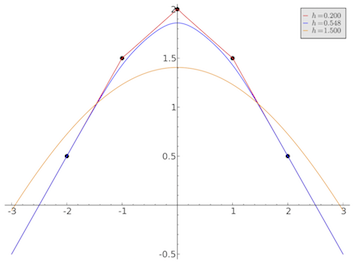
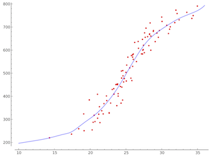

# Univariate data interpolation by locally linear regression

Here we archive some code written in C, and wrapped in the Sage extension of Python, for doing univariate, locally linear regression. This code assisted in the writing of the article, 

   [Moving beyond moving averages in data interpolation](smoothers.pdf). 
   
The code itself is not maintained.

&copy; Anthony Blaom 2015, 2017
